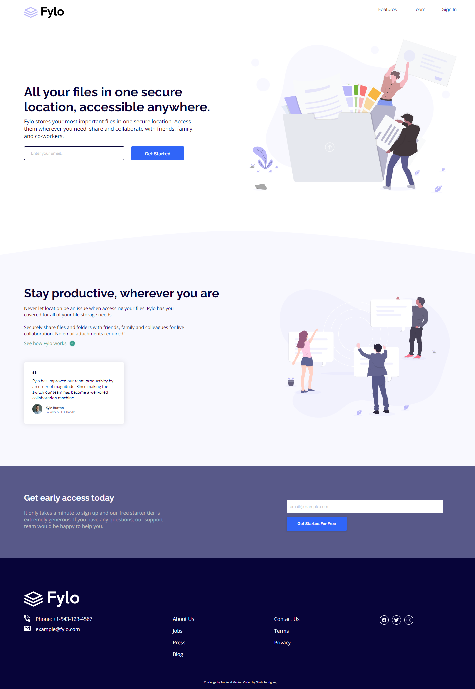

# Sobre o Projeto
Projeto clone do desafio [FrontEnd Mentor](https://www.frontendmentor.io/challenges/fylo-landing-page-with-two-column-layout-5ca5ef041e82137ec91a50f5) utilizado o conceito mobile first na responsividade da aplicação, aplicado SCSS juntamente com a metodologia BEM (convenção de nomenclatura de classe css) para ajudar na organização do estilo da página e facilitar na manutenção.

## Desing Mobile	

## Design Desktop

# Tecnologias utilizadas
* HTML
* SCSS
* JS

### Observação
* Utilizado Extensão do VSCODE Live SASS Compiler para gerar o CSS estatico (main.css)
